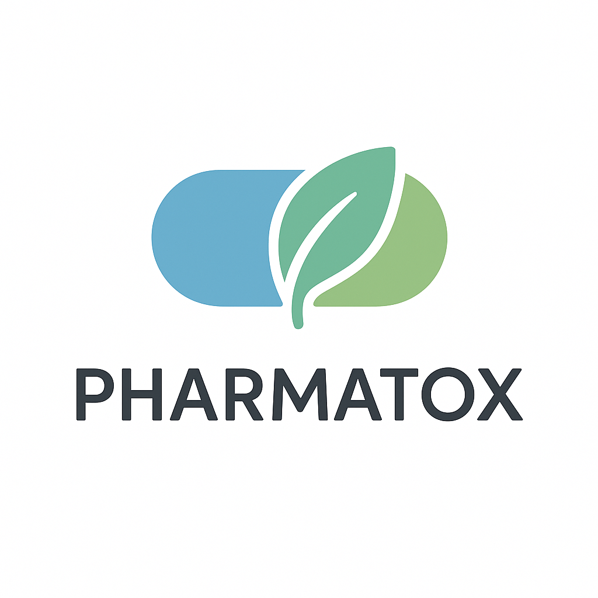

# Pharmatox

## Takım İsmi

**Pharmatox Crew**

## Takım Logosu

## Takım Üyeleri

|    | Name                  | Role            
|----|-----------------------|-----------------
|   | Ahmet Erol Bayrak     | Product Owner 
|     | Safiye Yıldız Sıbıç  | Scrum Master
|     | Emine Erbul    | Developer    
|     | Betül Toyoğlu       | Developer    
| | Berkay Özerdem     | Developer     

---

## Proje Açıklaması

**Pharmatox**; kullanıcıların ilaçları hızlıca tanımasını, anlamasını ve güvenle kullanmasını sağlayan, kişisel sağlık asistanı mobil uygulamasıdır.
- AI ile prospektüs özetleme, doz hatırlatma, yan etki günlüğü, reçeteden foto ile otomatik ilaç ekleme gibi temel fonksiyonlara sahiptir.
- Tüm modüller Flutter ile geliştirilmiş, Android & iOS desteği vardır.
- Kullanıcı profili ve kişiselleştirilmiş uyarı sistemi ile sağlık güvenliğini ve erişilebilirliği önceliklendirir.

---

## Ana Özellikler

- İlaç arama & prospektüs analizi (AI ile)
- Kişisel profil oluşturma (yaş, cinsiyet, sağlık durumu)
- Doz planı ve hatırlatıcılar
- Yan etki günlüğü (AI ile analiz)
- Reçete fotoğrafından otomatik ilaç ekleme
- Lokal veri saklama ve offline destek

---

## Hedef Kitle

- Kronik hastalar, yaşlılar, ilaç kullanan herkes
- Sağlık çalışanları ve hasta yakınları

---

# Sprint 1

### Sprint Notları
- Sprint 1, tamamen planlama ve hazırlık aşamasına ayrıldı.  
- Takım olarak projenin vizyonu, ana modülleri ve user story’leri çıkarıldı.
- Product Backlog board’u oluşturuldu.
- Görev dağılımı ve teknik mimari planlandı.
- Kullanıcı persona’ları belirlendi.

### Tahmin Mantığı
Sprint 1’deki işlerin zorluk derecesine ve tahmini iş yüküne göre story point puanları verilmiştir. Küçük işler 4-6, orta işler 8-10, kapsamlı işler ise 10 puan olarak belirlenmiştir. Toplamda sprint başına 100 puanlık iş hedeflenmiştir.

### Sprint İçinde Tamamlanması Tahmin Edilen Puan:  
100 Puan

###Sprint 1 Puanları
| Görev                                      | Puan |
|---------------------------------------------|------|
| Proje Vizyonunun Netleştirilmesi            | 6    |
| Kullanıcı Persona’larının Oluşturulması     | 6    |
| Teknik Mimari ve Widget Tree Planı          | 10   |
| Ana User Story’lerin Yazılması              | 10   |
| Product Backlog’un Oluşturulması            | 6    |
| Takım İçi Görev Dağılımı                    | 4    |
| API Akışının Tasarlanması                   | 6    |
| Teknik Mimari Taslağı ve Widget Tree Çalışma| 6    |
| UI/UX Tasarımının Yapılması                 | 10   |
| Sprint Board’un Kurulması ve Ekibe Açılması | 4    |
| Takım İçi Görev Dağılımı Tablosu            | 4    |
| Daily Scrum                                 | 4    |
| Dokümantasyon Şablonlarının Eklenmesi       | 4    |
| Text-to-Speech mantığıyla geliştirme (rejected)| 10   |
| **Toplam**                                  | 100  |

### Puan Tamamlama Mantığı  
Toplam 300 puanlık backlogun ilk sprintte 100 puanlık kısmı, planlama ve hazırlık işlerinden oluştu.

### Backlog Düzeni ve Story Seçimleri  
Sprint 1’in tamamı:  
- Proje vizyonu ve ana modüllerin belirlenmesi  
- User story’lerin yazılması  
- Backlog’un çıkarılması  
- Teknik mimarinin hazırlanması  
- Takım içi görev dağılımı  
- Kullanıcı personası çalışmaları  
- Sprint board’un kurulumu

### Daily Scrum
- Tüm daily scrum toplantıları WhatsApp üzerinden yapıldı, kararlar grup sohbetinde arşivlendi.
https://ibb.co/rG7gj0kp
https://ibb.co/V0XszqJR

### Sprint Board Update
- 

### Sprint Review
- Takım hedeflerinin tamamını gerçekleştirdi.
- Hazırlık aşaması ve iş bölümü tamamlandı.
- Kodlama veya uygulama geliştirme bu sprintte başlamadı.

### Sprint Retrospective
- Takım içi iletişim ve planlama üzerinde çalışılması gerekmekte.
- Bir sonraki sprintte doğrudan kodlamaya ve modül geliştirmeye geçilecek.

### Ürün durumu

[Pharmatox MVP Blueprint](https://spedatoxstuff.notion.site/Pharmatox-226af35bd24e80c9ad0bfc9f989489fc)
---

## Kullanılan Asset’ler / Kaynaklar
- Henüz sprint 1’de kullanılmadı.

---

# Sprint 2 

## Tarih Aralığı
_7 Temmuz 2025 – 20 Temmuz 2025_

---

## Sprint Hedefi

Bu sprintte, uygulamanın kullanıcı deneyimi (UI/UX) tasarımının tamamlanması, sistem promptunun netleştirilmesi, Gemini entegrasyonu ve Google Search API bağlantısı gibi temel entegrasyonların planlanması hedeflenmiştir.

---

##  Tamamlanan Görevler

| Görev Açıklaması                 | Durum     |
|----------------------------------|-----------|
| UI/UX Tasarımı (güncel prototip) |  Tamamlandı |
| Sistem Promptu Tasarımı          |  Tamamlandı |
| Google Search Entegrasyonu       |  Planlandı, kısmen hazırlandı |
| Gemini Entegrasyonu              |  Henüz yapılmadı |

---

## Açıklamalar

- UI/UX tasarımı, kullanıcı yolculuğu baz alınarak revize edildi ve en güncel hali uygulamaya aktarıldı.
- Sistem promptu tamamlandı. AI tabanlı ilaç tanıma, yan etki açıklama ve öneri mekanizmasının temelini oluşturacak şekilde hazırlandı.
- Uygulamanın son sürümü gözden geçirildi: İlaç takibi, etkileşimler ve yan etkiler bölümleri temel işlevlere sahip, ancak 3. sprintte detaylandırılacak alanlar tespit edildi.
- Google Search API entegrasyonu için yapı hazırlandı, test süreci başlatılmadı.
- Gemini entegrasyonu henüz yapılmadı Sprint 3'e ertelenecek.

---

## Test ve Değerlendirme

- Uygulamanın son build'i gözlemlendi.
- Kullanıcı deneyimi açısından ilaç etkileşimleri ve yan etkiler ekranlarında eksikler not alındı.
- AI modülünün vereceği yanıtların sisteme etkisi sistem promptu ile sınırlandırıldı ve tanımlandı.

---

## Sprint Review

- Tasarımsal kararlar ve sistem promptu başarıyla finalize edildi.
- Takımın teknik entegrasyonlar üzerindeki zamanlaması Sprint 3'e daha fazla kaynak ayırmayı gerektirecek şekilde değerlendirildi.
- Öncelik sıralaması tekrar yapıldı.

---

## Sprint Retrospective

| Güçlü Yönler                         | Geliştirilmesi Gerekenler              | Alınan Aksiyonlar                      |
|--------------------------------------|----------------------------------------|----------------------------------------|
| Sistem promptu açık, güçlü ve net    | Entegrasyonlar zamanında başlayamadı   | Sprint 3 öncesi teknik ön hazırlık yapılacak |
| UI tasarımları ekipçe sahiplenildi  | | Entegrasyon sorumlulukları netleştirilecek |

---

## Sprint 3’e Bırakılanlar

- Gemini API entegrasyonu
- Google Search entegrasyonu testleri
- İlaç takibi & etkileşim modüllerinin detaylandırılması
- Yan etki günlüğü analiz modülünün genişletilmesi
- Yeni özellik önerilerinin değerlendirilmesi

---

## ekran görüntüleri

---

## Not

Bu sprint, sistemin temel taşı niteliğinde olan tasarım ve yapay zeka davranışlarının belirlenmesine odaklanmıştır. Geliştirme süreci Sprint 3 ile birlikte daha fonksiyonel modüllere geçecektir.
